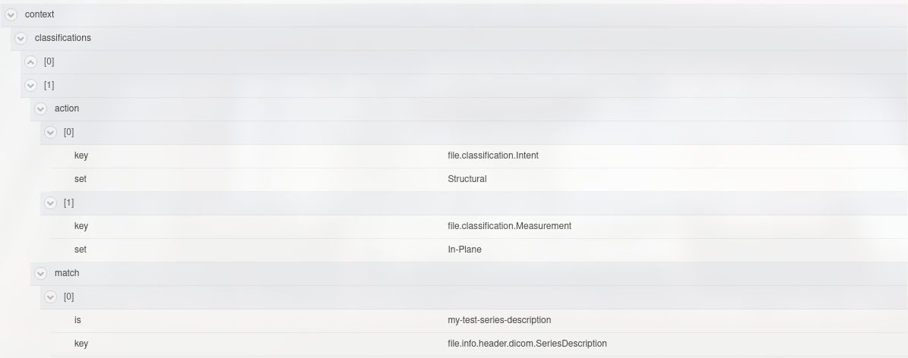

# File Classifier

## Overview

The file classifier gear provides a gear interface to the
[classification-toolkit](https://gitlab.com/flywheel-io/public/classification-toolkit)
and is essentially just a wrapper around the classification-toolkit.

For documentation on classification in general, please consult the
[classification-toolkit documentation](https://flywheel-io.gitlab.io/public/fw-classification/fw-classification/)

The file classifier gear uses the file type of the provided input to determine
the proper
[adapter](https://flywheel-io.gitlab.io/public/fw-classification/fw-classification/adapters.html)
to use.

## Supported file types

Currently the gear supports classification of the following file types:

* `dicom`: via the `file.info.header.dicom` namespace which is populated using
the
[file-metadata-importer](https://gitlab.com/flywheel-io/flywheel-apps/file-metadata-importer)
gear.
* `nifti`: via a `json` sidecar which is found in the same container as the
input.

## Usage

### Inputs

* __file-input__: The file to classify
* __profile__: Optional profile to use for classification, if passed in, this
will override the default classification profile and use what was passed in.
See documentation for creating a profile at the
[classification-toolkit docs](https://flywheel-io.gitlab.io/public/fw-classification/fw-classification/profile.html)
* __classifications__: An optional list of context classifications set at the
project level, see
[Setting project classifications](#project-classifications).  These
classifications are added as the final block to the profile that is being
used to classify, therefore they get highest priority.

### Configuration

* __debug__ (boolean, default False): Include debug statements in output.
* __tag__ (str, default 'file-classifier'): String to tag the file after
classification. Useful for gear-rule pipelines triggered by tags.

### Which profile will be used?

The priority for determining which profile will be used is as so:

1. Profile passed in via the optional _input_ `profile`
2. Default profile `main.yml` described in the
[classification-profiles](https://gitlab.com/flywheel-io/public/classification-profiles)
repo.

The profile being used will be printed out at the beginning of the gear.

**Note**: _After_ the profile has been determined, context classifications will be
added as a block to that profile, i.e. context-classifications _always_ have the
highest priority.

### Project Classifications

Project classifications can be set both in the UI or via the SDK.  They
follow the same structure as a
[block](https://flywheel-io.gitlab.io/public/fw-classification/fw-classification/profile.html#blocks)
in a classification profile.

#### Setting via SDK

Given an example, custom SeriesDescription that looks like "my-test-series-description",
you can re-classify these files as `Intent: Structural, Measurement: In-Plane` with the following:

```python
import flywheel
fw = flywheel.Client()
proj = fw.get_project(<proj_id>) # or use lookup()
existing_info = proj.info
# Initialize context classifications if they don't exist
existing_info.setdefault('context', {}).setdefault('classifications', [])
existing_info['context']['classifications'].append(
    {
        'match': [{
            'key': 'file.info.header.dicom.SeriesDescription',
            'is': 'my-test-series-description',
        }],
        'action': [
            {'key': 'file.classification.Intent', 'set': 'Structural'},
            {'key': 'file.classification.Measurement', 'set': 'In-Plane'}
        ]
    }
)
proj.replace_info(existing_info)
```

The above will append a single rule to the custom block.  In the UI this will then look like:


#### Setting via UI

You can also set the same custom classifications above via the UI custom info builder.

## Contributing

For more information about how to get started contributing to that gear,
checkout [CONTRIBUTING.md](CONTRIBUTING.md).
